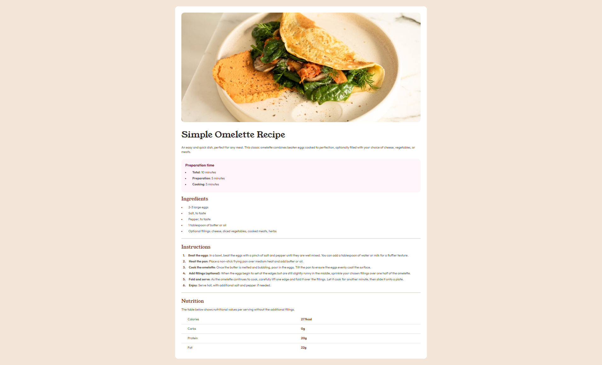

# Frontend Mentor - Recipe page solution

This is a solution to the [Recipe page challenge on Frontend Mentor](https://www.frontendmentor.io/challenges/recipe-page-KiTsR8QQKm).

## Overview

### Screenshot

;

### Links

- Solution URL: [Github Repository](https://github.com/guilhermedevl/fm-recipe-chal)
- Live Site URL: [Netlify](https://guilhermedev-fm-receip.netlify.app/)

## My process

### Built with

- HTML5 markup
- CSS custom properties
- Flexbox

## Author

- Frontend Mentor - [@guilhermedevl](https://www.frontendmentor.io/profile/guilhermedevl)
- GitHub - [@guilhermedevl](https://github.com/guilhermedevl)
